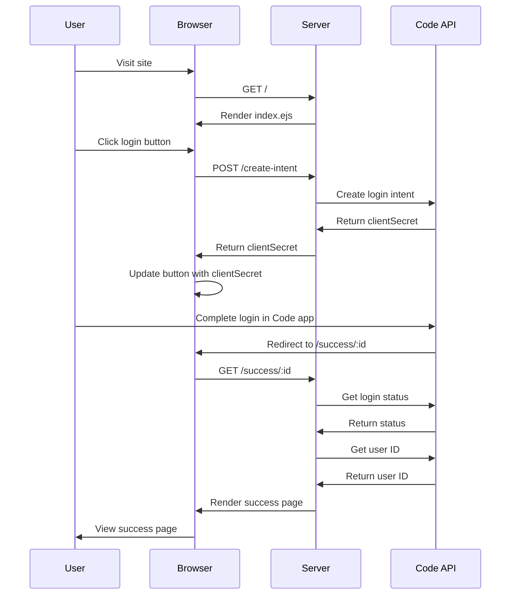

## Integration Specification

### Server Setup:
- Use Express.js to create a server
- Set up EJS as the view engine
- Generate a Keypair for verification
- Define routes for the main page, success page, and Code Payments JSON file
- Create a route to handle login intent creation

### Client-Side Implementation:
- Use the Code SDK (imported from 'https://js.getcode.com/v1')
- Create a login button using `code.elements.create('button')`
- Configure the button with login parameters (verifier and domain)
- Set up success and cancel URLs for confirmation
- Implement an 'invoke' event listener for the button click
- Fetch clientSecret from the server when the button is clicked
- Update the button with the received clientSecret

### Login Flow:
1. User visits the main page
2. Server renders index.ejs with verifier public key and domain
3. User clicks the login button
4. Client sends a POST request to /create-intent
5. Server creates a login intent using `code.loginIntents.create()`
6. Server returns clientSecret to the client
7. Client updates the button with the clientSecret
8. User completes login in the Code app
9. Code app redirects to the success URL with the intent ID

### Success Page:
- Server receives a GET request to /success/:id
- Server fetches login status and user ID from Code API
- Server renders the success page with intent ID, status, and user ID

### Domain Verification:
- Implement a route for /.well-known/code-payments.json
- Return a JSON object containing the verifier's public key
```